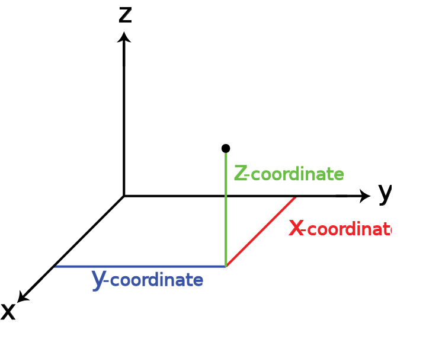

# View Camera Space and Projection Space for Games
The goal of this document is describe the mininum math components to build a general camera model for rendering a 3D world.

## What is a camera in video games
Basacly in a nutshell a camera is an abstract object that is used to bounded what the game should display to player. Ok, everyone knows that but wait..... have you ever ask about how it works? 

Lets to start imagining a fantasy enviroment with some buildings, a main character , some props, etc all those things are set in some part of the space of our 3d enviroment.  Every object has been builded with 3 dimensions also they are laying in a 3D Space but, when player watch the TV the player see only 2D images... WOOOOW how should this posible

Wait... from 3D to 2D ... What is just I read!. But I watch the depth in the image displayed from TV every time that I Move the character or my game camera... what is the magic?

The first resposability of a camera model is transforming the 3D data in world space into a 3D data into a view Space.   

## Components of a camera

Every content in our enviroment has been created using a coordinate system for our case a euclidian space, and each object is placed in relative each other also if any of those do not have a parent object. For instance

Enviroment:

    - Ground (0,0,0)
        - field
        - Forest
            - Tree_A
                - leaf
                - trunk
            - Tree_B
            - Tree_C
    - Player (10,0,0)
     
In this world the objects Ground and  player was placed without any relative object, but they exists in the space. what happen here! the artist modeled those objects in cordinate space 

What does it means? 

1. The ground is in the origin of the coordinate system 
2. Player is place in 10 units from the origin in the x-axes 

$$ 
Ground= \begin{bmatrix}0 \\ 0\\ 0 \end{bmatrix} 
Player=\begin{bmatrix}10 \\ 0\\ 0 \end{bmatrix} 
$$ (1) 

3. World Space 
